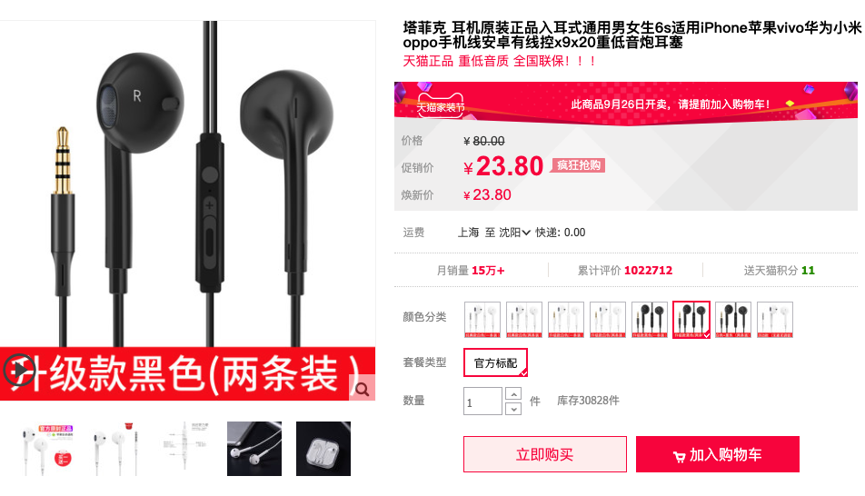
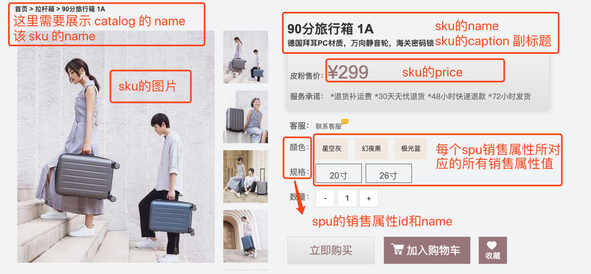

## 商品模块

### 一. SKU 和 SPU

一个电商系统，SPU、SKU等设计的好坏，影响到后面的开发进度，以及架构的调整等。而 SPU、SKU又是一个电商系统的核心，我们一起参考淘宝设计来讲清楚什么是 SPU、SKU。

SPU，是 standard product unit，标准化产品单元，是商品信息聚合的最小单位，属性值、特性相同的商品就可以成为一个SPU。在淘宝中你可能看不到 spu 这个概念，淘宝商品都拥有商品 ID(item design)，其实就是 spu。不像京东，直接来个 spuId = xxx 这样的直观。

SKU，全称 stock keeping unit，库存量单位。SKU 是用来定价和管理库存的。例如：7 Plus 有很多颜色，很多配置，每个颜色和配置的组合都会形成新的产品，这时就产生很多 SKU，SKU 在传统线下行业也是一个非常常用的概念，尤其是服装行业，同款不同尺码不同色都是独立的 SKU，需要有独立的条形码，独立的库存管理等。

下面我们一起来看看淘宝中的 SPU 和 SKU，加深大家的认识。

当我们在浏览器里访问：https://detail.tmall.com/item.htm?id=525248995106&skuId=4225910992958 和 https://detail.tmall.com/item.htm?id=525248995106&skuId=4225910992962 时，会看到两款不同的商品，这就是 SPU。每款商品中有不同的颜色，规格，尺寸等代表的就是 SKU。



以 https://detail.tmall.com/item.htm?id=525248995106&skuId=4225910992961 为例，当我们选择不同的颜色后，浏览器地址栏中的 skuId 就会跟着变化。选择不同的颜色，价格和库存都会跟着变化，这就是 SKU 决定了一个商品的价格和库存。

上面的 id 就对应着一个 SPU，一个 SPU 可以有多个 SKU。SPU 用来区分品种，一般商家用来统计某个品种的销量。比如，A 商家统计 iphone 8 销量，就是 SPU 的维度来统计的。也可以从 SKU 的方向来统计，比如：A 商家统计 iphone 8 中黑色64G的销量。

大家都去过超市买东西吧，到收银台的时候，收银员手里有一个扫码枪，她会一个一个的扫你购买的商品上条形码。这个条形码就对应一个 SKU，一个 SKU 对应一个条形码。

### 二. 表结构设计以及models

#### 1. 表结构设计

 [达达电商商品模块表结构设计.html](达达电商商品模块表结构设计.html) 

#### 2. models编写

根据之前设计好的表结构来写models.py文件

```python
from django.db import models


class Catalog(models.Model):
    """
    商品类别
    """
    create_time = models.DateTimeField(auto_now_add=True, verbose_name="创建时间")
    update_time = models.DateTimeField(auto_now=True, verbose_name="更新时间")
    name = models.CharField(max_length=10, verbose_name='类别名称')

    class Meta:
        db_table = 'DDSC_GOODS_CATALOG'
        verbose_name = '商品类别'
        verbose_name_plural = verbose_name

    def __str__(self):
        return self.name


class Brand(models.Model):
    """
    品牌
    """
    create_time = models.DateTimeField(auto_now_add=True, verbose_name="创建时间")
    update_time = models.DateTimeField(auto_now=True, verbose_name="更新时间")
    name = models.CharField(max_length=20, verbose_name='商品名称')
    logo = models.ImageField(verbose_name='Logo图片')
    first_letter = models.CharField(max_length=1, verbose_name='品牌首字母')

    class Meta:
        db_table = 'DDSC_BRAND'
        verbose_name = '品牌'
        verbose_name_plural = verbose_name

    def __str__(self):
        return self.name


class SPU(models.Model):
    create_time = models.DateTimeField(auto_now_add=True, verbose_name="创建时间")
    update_time = models.DateTimeField(auto_now=True, verbose_name="更新时间")
    name = models.CharField(max_length=50, verbose_name='名称')
    sales = models.IntegerField(default=0, verbose_name='商品销量')
    comments = models.IntegerField(default=0, verbose_name='评价数量')
    brand = models.ForeignKey(Brand, on_delete=models.PROTECT, verbose_name='品牌')
    catalog = models.ForeignKey(Catalog, on_delete=models.PROTECT, related_name='catalog_goods', verbose_name='商品类别')

    class Meta:
        db_table = 'DDSC_SPU'
        verbose_name = 'SPU'
        verbose_name_plural = verbose_name

    def __str__(self):
        return self.name


class SPUSaleAttr(models.Model):
    """
    SPU销售属性表
    """
    create_time = models.DateTimeField(auto_now_add=True, verbose_name="创建时间")
    update_time = models.DateTimeField(auto_now=True, verbose_name="更新时间")
    SPU_id = models.ForeignKey(SPU, on_delete=models.CASCADE, verbose_name='SPU')
    # sale_attr_value_name = models.CharField(max_length=20, verbose_name='SPU属性值名称')
    # sale_attr_id = models.IntegerField(default=0, verbose_name='SPU销售属性ID')
    sale_attr_name = models.CharField(max_length=20, verbose_name='SPU属性名称')

    class Meta:
        db_table = 'DDSC_SPU_SALE_ATTR'
        verbose_name = 'SPU销售属性'
        verbose_name_plural = verbose_name

    def __str__(self):
        return '%s' % (self.sale_attr_name)


class SaleAttrValue(models.Model):
    """
    销售属性值表
    """
    create_time = models.DateTimeField(auto_now_add=True, verbose_name="创建时间")
    update_time = models.DateTimeField(auto_now=True, verbose_name="更新时间")
    sale_attr_id = models.ForeignKey(SPUSaleAttr, on_delete=models.CASCADE, verbose_name='销售属性id')
    sale_attr_value_name = models.CharField(max_length=20, verbose_name='销售属性值名称')

    class Meta:
        db_table = 'DDSC_SALE_ATTR_VALUE'
        verbose_name = '销售属性值'
        verbose_name_plural = verbose_name

    def __str__(self):
        return '%s - %s' % (self.sale_attr_id, self.sale_attr_value_name)


class SKU(models.Model):
    """
    SKU
    """
    create_time = models.DateTimeField(auto_now_add=True, verbose_name="创建时间")
    update_time = models.DateTimeField(auto_now=True, verbose_name="更新时间")
    name = models.CharField(max_length=50, verbose_name='SKU名称')
    caption = models.CharField(max_length=100, verbose_name='副标题')
    SPU_ID = models.ForeignKey(SPU, on_delete=models.CASCADE, verbose_name='商品')
    price = models.DecimalField(max_digits=10, decimal_places=2, verbose_name='单价')
    cost_price = models.DecimalField(max_digits=10, decimal_places=2, verbose_name='进价')
    market_price = models.DecimalField(max_digits=10, decimal_places=2, verbose_name='市场价')
    stock = models.IntegerField(default=0, verbose_name='库存')
    sales = models.IntegerField(default=0, verbose_name='销量')
    comments = models.IntegerField(default=0, verbose_name='评价数')
    is_launched = models.BooleanField(default=True, verbose_name='是否上架销售')
    default_image_url = models.ImageField(verbose_name='默认图片')

    class Meta:
        db_table = 'DDSC_SKU'
        verbose_name = 'SKU表'
        verbose_name_plural = verbose_name

    def __str__(self):
        return '%s: %s' % (self.id, self.name)


class SKUImage(models.Model):
    """
    SKU图片
    """
    create_time = models.DateTimeField(auto_now_add=True, verbose_name="创建时间")
    update_time = models.DateTimeField(auto_now=True, verbose_name="更新时间")
    sku_id = models.ForeignKey(SKU, on_delete=models.CASCADE, verbose_name='sku')
    image = models.ImageField(verbose_name='图片路径')

    class Meta:
        db_table = 'DDSC_SKU_IMAGE'
        verbose_name = 'SKU图片'
        verbose_name_plural = verbose_name

    def __str__(self):
        return '%s %s' % (self.sku_id.name, self.id)


class SKUSaleAttrValue(models.Model):
    """
    SKU销售属性值表
    """
    create_time = models.DateTimeField(auto_now_add=True, verbose_name="创建时间")
    update_time = models.DateTimeField(auto_now=True, verbose_name="更新时间")
    sku = models.ForeignKey(SKU, on_delete=models.CASCADE, verbose_name='sku')
    sale_attr_value_id = models.ForeignKey(SaleAttrValue, on_delete=models.PROTECT, verbose_name='销售属性值')

    class Meta:
        db_table = 'DDSC_SKU_SALE_ATTR_VALUE'
        verbose_name = 'SKU销售属性值表'
        verbose_name_plural = verbose_name

    def __str__(self):
        return '%s' % (self.sku,)
```

### 三. 首页展示

#### 1. 接口设计

接口设计遵循 restful 设计模式，在 dashop 下的url：

```python
urlpatterns = [
    url(r'^admin/', admin.site.urls),
    url('^v1/goods/', include('goods.urls')),
]
```

在 goods app 下的商城首页展示 url 设计：

```python
urlpatterns = [
    url(r'^index/$', views.GoodsIndexView.as_view()),
]
```

#### 2. 细节说明

首页展示主要是根据 catalog 来展示，在每个 catalog 分类下展示其中三个 sku，需要展示每个 sku 的***名称，副标题，价格，图片***等信息。与此同时还需要展示 ***catalog 名称***。

##### 注意：在做首页展示的时候，必须保证每个 catalog 下至少有三个 sku 的数据，否则页面显示异常。


#### 3. 代码说明

```python
class GoodsIndexView(View):
    def get(self, request):
        """
        首页商品及分类项展示

        商城默认有三个品类：
        名称         id
        拉杆箱        101
        背包         102
        手提包       103
        :param result:
        :return:
        """
        # 127.0.0.1:8000/v1/goods/index
        # 0. 获取所有品类
        catalog_list = Catalog.objects.all()

        # 1. 获取各个catalog下的三条sku数据，首页每个品类下面默认显示三个sku
        if request.method == "GET":
            index_data = []
            # 从redis中获取所有数据
            redis_conn = get_redis_connection('goods')
            redis_index  = redis_conn.get('index_cache')
            if redis_index is None:
                print("未使用缓存")
                for cata in catalog_list:
                    catalog_dic = {}
                    catalog_dic["catalog_id"] = cata.id
                    catalog_dic["catalog_name"] = cata.name
                    # 1.1 获取拉杆箱sku
                    spu_ids = SPU.objects.filter(catalog=cata.id).values("id")
                    sku_list = SKU.objects.filter(SPU_ID__in=spu_ids, is_launched=True)[:3]
                    catalog_dic["sku"] = []
                    for sku in sku_list:
                        sku_dict = dict()
                        sku_dict['skuid'] = sku.id
                        sku_dict['caption'] = sku.caption
                        sku_dict['name'] = sku.name
                        sku_dict['price'] = str(sku.price)
                        sku_image_count = SKUImage.objects.filter(sku_id=sku.id).count()
                        # 如果该sku没有指定图片，则选取默认图片进行展示
                        if sku_image_count == 0:
                            sku_image = str(sku.default_image_url)
                        else:
                            sku_image = str(SKUImage.objects.get(sku_id=sku.id).image)
                        sku_dict['image'] = sku_image
                        catalog_dic["sku"].append(sku_dict)
                    index_data.append(catalog_dic)
                    # 写入缓存
                redis_conn.set("index_cache", json.dumps(index_data))
            else:
                print("使用缓存")
                index_data = json.loads(redis_index)
            result = {"code": 200, "data": index_data, "base_url": PIC_URL}

            return JsonResponse(result)
```


### 四. 列表页展示

#### 1. 接口设计

接口设计遵循 restful 设计模式，在 dashop 下的url：

```python
urlpatterns = [
    url(r'^admin/', admin.site.urls),
    url('^v1/goods/', include('goods.urls')),
]
```

在 goods app 下的列表页展示 url 设计：

```python
urlpatterns = [
    # 需要传入 catalog_id，因为分类是根据类别的 id 去区分的
    url(r'^catalogs/(?P<catalog_id>\d+)', views.GoodsListView.as_view()),
]
```

#### 2. 细节说明

分类是根据sku在列表页会显示该分类下的所有 sku，需要展示的数据有 sku 图片，如果该 sku 有默认图片，则显示默认的，如果没有默认图片，需要从 sku 图片表中查询。列表展示中运用到了分页功能，是使用 Paginator 实现的。


#### 3. 代码说明

```python
class GoodsListView(View):
    def get(self, request, catalog_id):
        """
        获取列表页内容
        :param request:
        :param catalog_id: 分类id
        :param page_num: 第几页
        :param page_size: 每页显示多少项
        :return:
        """
        # 127.0.0.1:8000/v1/goods/catalogs/1/?launched=true&page=1
        # 0. 获取url传递参数值
        if request.method == "GET":
            launched = bool(request.GET.get('launched', True))
            page_num = request.GET.get('page', 1)
            # 1.获取分类下的sku列表
            spu_list_ids = SPU.objects.filter(catalog=catalog_id).values("id")
            sku_list = SKU.objects.filter(SPU_ID__in=spu_list_ids, is_launched=launched).order_by("id")
            # 2.分页
            # 创建分页对象，指定列表、页大小
            page_num = int(page_num)
            page_size = 9
            try:
                paginator = Paginator(sku_list, page_size)
                # 获取指定页码的数据
                page_skus = paginator.page(page_num)
                page_skus_json = []
                for sku in page_skus:
                    sku_dict = dict()
                    sku_dict['skuid'] = sku.id
                    sku_dict['name'] = sku.name
                    sku_dict['price'] = str(sku.price)
                    sku_image_count = SKUImage.objects.filter(sku_id=sku.id).count()
                    # 如果该sku没有指定图片，则选取默认图片进行展示
                    if sku_image_count == 0:
                        sku_image = str(sku.default_image_url)
                    else:
                        sku_image = str(SKUImage.objects.get(sku_id=sku.id).image)
                    sku_dict['image'] = sku_image
                    page_skus_json.append(sku_dict)
            except:
                result = {'code': 40200, 'error': '页数有误，小于0或者大于总页数'}
                return JsonResponse(result)
            result = {'code': 200, 'data': page_skus_json, 'paginator':{'pagesize':page_size, 'total': len(sku_list)}, 'base_url': PIC_URL}
            return JsonResponse(result)
```


### 五. 详情页展示

#### 1. 接口设计

接口设计遵循 restful 设计模式，在 dashop 下的url：

```python
urlpatterns = [
    url(r'^admin/', admin.site.urls),
    url('^v1/goods/', include('goods.urls')),
]
```

在 goods app 下的商城首页展示 url 设计：

```python
urlpatterns = [
    url(r'^detail/(?P<sku_id>\d+)/$', views.GoodsDetailView.as_view()),
]
```

#### 2. 细节说明

详情页展示，展示的是每个 sku 下的具体信息，所以需要参数 sku_id。

这里需要传递的数据有：

1. 类别的id，类别的名称
2. sku的名称，sku的副标题，sku的id，sku的图片
3. spu的销售属性id以及名称，spu的销售属性值id以及名称



这里还有个需要注意的地方，就是 sku 销售属性值高亮显示的问题，当我们打开一个详情页的时候，必然是所有的属性已经有了该 sku 的所有销售属性值，并将该 sku 的属性值高亮显示，所以我们还需要从 SKUSaleAttrValue  和 SaleAttrValue 表中拿到 sku 销售属性值的id和name，将数据交给前端进行比较，从而高亮显示：


至于切换在详情页切换 sku 的功能会在后续说到。

在详情页使用到了redis，作用是如果在指定时间内请求访问同一个 sku 下的数据时，直接从缓存中拿数据，减轻数据库压力。

#### 3. 代码说明

```python
class GoodsDetailView(View):
    def get(self, request, sku_id):
        """
        获取sku详情页信息，获取图片暂未完成
        :param request:
        :param sku_id: sku的id
        :return:
        """
        # 127.0.0.1:8000/v1/goods/detail/401/
        # 1. 获取sku实例
        if request.method == "GET":
            sku_details = {}
            # 从redis中获取所有数据
            redis_conn = get_redis_connection('goods')
            redis_detail = redis_conn.get('goods_%s' % sku_id)
            if redis_detail is None:
                print("未使用缓存")
                try:
                    sku_item = SKU.objects.get(id=sku_id)
                except:
                    # 1.1 判断是否有当前sku
                    result = {'code': 40300, 'error': "Such sku doesn' exist", }
                    return JsonResponse(result)
                sku_catalog = sku_item.SPU_ID.catalog
                sku_image = ''
                sku_image_count = SKUImage.objects.filter(sku_id=sku_item.id).count()
                # 如果该sku没有指定图片，则选取默认图片进行展示
                if sku_image_count == 0:
                    sku_image = str(sku_item.default_image_url)
                else:
                    sku_image = str(SKUImage.objects.get(sku_id=sku_item.id).image)
                sku_details['image'] = sku_image
                sku_details["spu"] = sku_item.SPU_ID.id
                sku_details["name"] = sku_item.name
                sku_details["caption"] = sku_item.caption
                sku_details["price"] = str(sku_item.price)
                sku_details["catalog_id"] = sku_catalog.id
                sku_details["catalog_name"] = sku_catalog.name

                # 2. 获取sku销售属性名称和sku销售属性值
                sku_sale_attrs_val_lists = SKUSaleAttrValue.objects.filter(sku = sku_id)
                sku_sale_attr_val_names = [] # 保存sku销售属性值名称的list
                sku_sale_attr_val_id = []
                sku_sale_attr_names = [] # 保存sku销售属性名称的list
                sku_sale_attr_id = []
                sku_all_sale_attr_vals_name = {}
                sku_all_sale_attr_vals_id = {}

                # 传递sku销售属性id和名称  以及  sku销售属性值id和名称
                for sku_sale_attrs_val in sku_sale_attrs_val_lists:
                    sku_sale_attr_val_names.append(sku_sale_attrs_val.sale_attr_value_id.sale_attr_value_name)
                    sku_sale_attr_val_id.append(sku_sale_attrs_val.sale_attr_value_id.id)
                    sku_sale_attr_names.append(sku_sale_attrs_val.sale_attr_value_id.sale_attr_id.sale_attr_name)
                    sku_sale_attr_id.append(sku_sale_attrs_val.sale_attr_value_id.sale_attr_id.id)
                    # 该销售属性下的所有属性值，供·页面选择使用
                    # SPU销售属性：颜色，容量
                    # 页面显示：
                    # 颜色： 红色，蓝色
                    # 容量：100ml，200ml
                    # 返回数据包含：
                    #   1. spu销售属性id，即颜色，容量两个属性的id
                    #   2. spu销售属性名称
                    #   3. 销售属性值id，即 红色id为1，蓝色id为2，100ml的id为3，200ml的id为4
                    #   4. 销售属性值名称
                    #   5. sku销售属性id及名称
                    attr = SPUSaleAttr.objects.get(id=sku_sale_attrs_val.sale_attr_value_id.sale_attr_id.id)
                    sku_all_sale_attr_vals_id[attr.id] = []
                    sku_all_sale_attr_vals_name[attr.id] = []
                    vals = SaleAttrValue.objects.filter(sale_attr_id=attr.id)
                    for val in vals:
                        print("attr.id:", attr.id)
                        print("val.id:", val.id, val.sale_attr_value_name)
                        sku_all_sale_attr_vals_name[int(attr.id)].append(val.sale_attr_value_name)
                        sku_all_sale_attr_vals_id[int(attr.id)].append(val.id)
                        print(sku_all_sale_attr_vals_name,sku_all_sale_attr_vals_id )
                sku_details['sku_sale_attr_id'] = sku_sale_attr_id
                sku_details['sku_sale_attr_names'] = sku_sale_attr_names
                sku_details['sku_sale_attr_val_id'] = sku_sale_attr_val_id
                sku_details['sku_sale_attr_val_names'] = sku_sale_attr_val_names
                sku_details['sku_all_sale_attr_vals_id'] = sku_all_sale_attr_vals_id
                sku_details['sku_all_sale_attr_vals_name'] = sku_all_sale_attr_vals_name
                # 写入缓存
                redis_conn.setex("goods_%s" % sku_id, 60*60*24, json.dumps(sku_details))
            else:
                print("使用缓存")
                sku_details = json.loads(redis_detail)

            result = {'code': 200, 'data': sku_details, 'base_url': PIC_URL}
            return JsonResponse(result)
```


### 六. 搜索功能

#### 1. 接口设计

接口设计遵循 restful 设计模式，在 dashop 下的url：

```python
urlpatterns = [
    url(r'^admin/', admin.site.urls),
    url('^v1/goods/', include('goods.urls')),
]
```

在 goods app 下的商城首页展示 url 设计：

```python
urlpatterns = [
    url(r'^search/', views.GoodsSearchView.as_view()),
]
```

#### 2. 细节说明

搜索功能使用了 Elasticsearch 搜索引擎。

#### 3. 代码说明

```python
class GoodsSearchView(View):
    def post(self,request, load_all=True, searchqueryset=None, extra_context=None):
        """
        首页查询功能
        :param request:
        :return:
        """
        # 127.0.0.1:8000/v1/goods/search/
        if request.method == "POST":
            query = ''
            page_size = 2
            results = EmptySearchQuerySet()
            if request.POST.get('q'):
                form = ModelSearchForm(request.POST, searchqueryset=searchqueryset, load_all=load_all)
                if form.is_valid():
                    query = form.cleaned_data['q']
                    results = form.search()
            else:
                form = ModelSearchForm(request.POST, searchqueryset=searchqueryset, load_all=load_all)

            paginator = Paginator(results, page_size)
            try:
                page = paginator.page(int(request.POST.get('page', 1)))
            except:
                result = {'code': 40200, 'data': '页数有误，小于0或者大于总页数'}
                return JsonResponse(result)

            # 记录查询信息
            context = {
                'form': form,
                'page': page,
                'paginator': paginator,
                'query': query,
                'suggestion': None,
            }

            if results.query.backend.include_spelling:
                context['suggestion'] = form.get_suggestion()

            if extra_context:
                context.update(extra_context)

            sku_list = []
            # print(len(page.object_list))
            for result in page.object_list:
                sku = {
                    'skuid': result.object.id,
                    'name': result.object.name,
                    'price': result.object.price,
                }
                sku_image_count = SKUImage.objects.filter(sku_id=result.object.id).count()
                # 如果该sku没有指定图片，则选取默认图片进行展示
                if sku_image_count == 0:
                    sku_image = str(result.object.default_image_url)
                else:
                    sku_image = str(SKUImage.objects.get(sku_id=result.object.id).image)
                sku['image'] = sku_image
                sku_list.append(sku)
            result = {"code": 200, "data": sku_list, 'paginator': {'pagesize': page_size, 'total': len(results)}, 'base_url': PIC_URL}
            return JsonResponse(result)
```


### 七. 详情页 SKU 切换功能

#### 1. 功能设计

根据修改 SKU 的销售属性值确定出不同的sku，进而修改详情页的展示数据。

#### 2. 代码展示

```python
class GoodsChangeSkuView(View):
    def post(self, request):
        data = json.loads(request.body)
        # 将前端传来的销售属性值id放入列表
        sku_vals = []
        result = {}
        for k in data:
            if 'spuid' != k:
                sku_vals.append(data[k])
        sku_list = SKU.objects.filter(SPU_ID=data['spuid'])

        for sku in sku_list:
            sku_details = dict()
            sku_details['sku_id'] = sku.id
            # 获取sku销售属性值id
            sku_sale_attrs_val_lists = SKUSaleAttrValue.objects.filter(sku=sku.id)
            sku_sale_attr_val_id = []

            for sku_sale_attrs_val in sku_sale_attrs_val_lists:
                sku_sale_attr_val_id.append(sku_sale_attrs_val.sale_attr_value_id.id)
						# 若匹配，则返回skuid
            if sku_vals == sku_sale_attr_val_id:
                result = {"code": 200, "data": sku.id,}
        if len(result) == 0:
            result = {"code": 40050, "error": "no such sku",}
        return JsonResponse(result)
```


### 八. 商品上架以后后台管理功能

#### 1. 功能设计

我们将商品上架功能放到admin中来实现，需要分别对这八张表进行不同的操作，进而实现商品上架。上面首页展示提到本地缓存管理，意思是如果后台数据有变化的情况，我们需要清空缓存，否则会出现数据显示异常的情况，可以跟进 Django 的源码进行分析，最后得出所有的修改和删除的保存都是调用了 ModelAdmin 中的 save_model 和 delete_model 这两个方法，根据这个条件进行修改。

#### 2. admin模块代码（可拓展）展示：

```python
from django.contrib import admin
from .models import *
from django_redis import get_redis_connection


redis_conn = get_redis_connection("goods")


class BaseModel(admin.ModelAdmin):
    """
    继承admin.ModelAdmin
    重写save_model / delete_model 方法
    """
    def save_model(self, request, obj, form, change):
        super().save_model(request, obj, form, change)
        # 删除首页缓存
        redis_conn.delete('index_cache')
        print("保存数据时，首页缓存删除")

    def delete_model(self, request, obj):
        super().delete_model(request, obj)
        # 删除首页缓存
        redis_conn.delete('index_cache')
        print("删除数据时，首页缓存删除")


@admin.register(Brand)
class BrandAdmin(BaseModel):
    list_display = ['id', 'name']

    # list_per_page设置每页显示多少条记录，默认是100条
    list_per_page = 20

    # ordering设置默认排序字段，创建时间降序排序
    ordering = ('create_time',)


@admin.register(Catalog)
class CatalogAdmin(BaseModel):
    list_display = ['id', 'name']

    # list_per_page设置每页显示多少条记录，默认是100条
    list_per_page = 20

    # ordering设置默认排序字段，创建时间降序排序
    ordering = ('create_time',)


@admin.register(SPU)
class SPUAdmin(BaseModel):
    list_display = ['id', 'name', 'catalog']

    # list_per_page设置每页显示多少条记录，默认是100条
    list_per_page = 20

    # ordering设置默认排序字段，创建时间降序排序
    ordering = ('create_time',)

    # fk_fields 设置显示外键字段
    fk_fields = ('catalog',)

    search_fields = ('name', )  # 搜索字段


@admin.register(SPUSaleAttr)
class SPUSaleAttrAdmin(BaseModel):
    list_display = ['id', 'SPU_id', 'sale_attr_name']

    # list_per_page设置每页显示多少条记录，默认是100条
    list_per_page = 20

    # ordering设置默认排序字段，创建时间降序排序
    ordering = ('create_time',)

    # fk_fields 设置显示外键字段
    fk_fields = ('SPU_id',)

    search_fields = ('sale_attr_name',)  # 搜索字段


@admin.register(SKU)
class SKUAdmin(BaseModel):
    list_display = ['id', 'name', 'SPU_ID', 'is_launched',]
    # list_per_page设置每页显示多少条记录，默认是100条
    list_per_page = 20

    # ordering设置默认排序字段，创建时间降序排序
    ordering = ('create_time',)

    # fk_fields 设置显示外键字段
    fk_fields = ('SPU_id',)

    search_fields = ('name',)  # 搜索字段


@admin.register(SaleAttrValue)
class SaleAttrValueAdmin(BaseModel):
    list_display = ['id', 'sale_attr_value_name', 'sale_attr_id',]
    # list_per_page设置每页显示多少条记录，默认是100条
    list_per_page = 20

    # ordering设置默认排序字段，创建时间降序排序
    ordering = ('create_time',)

    # fk_fields 设置显示外键字段
    fk_fields = ('sale_attr_id',)

    search_fields = ('sale_attr_value_name',)  # 搜索字段


@admin.register(SKUSaleAttrValue)
class SKUSaleAttrValueAdmin(BaseModel):
    list_display = ['id', 'sku', 'sale_attr_value_id',]
    # list_per_page设置每页显示多少条记录，默认是100条
    list_per_page = 20

    # ordering设置默认排序字段，创建时间降序排序
    ordering = ('create_time',)

    # fk_fields 设置显示外键字段
    fk_fields = ('sku','sale_attr_value_id',)

    search_fields = ('sku',)  # 搜索字段


@admin.register(SKUImage)
class SKUImageAdmin(BaseModel):
    list_display = ['id', 'sku_id', 'image',]
    # list_per_page设置每页显示多少条记录，默认是100条
    list_per_page = 20

    # ordering设置默认排序字段，创建时间降序排序
    ordering = ('create_time',)

    # fk_fields 设置显示外键字段
    fk_fields = ('sku_id',)

```

